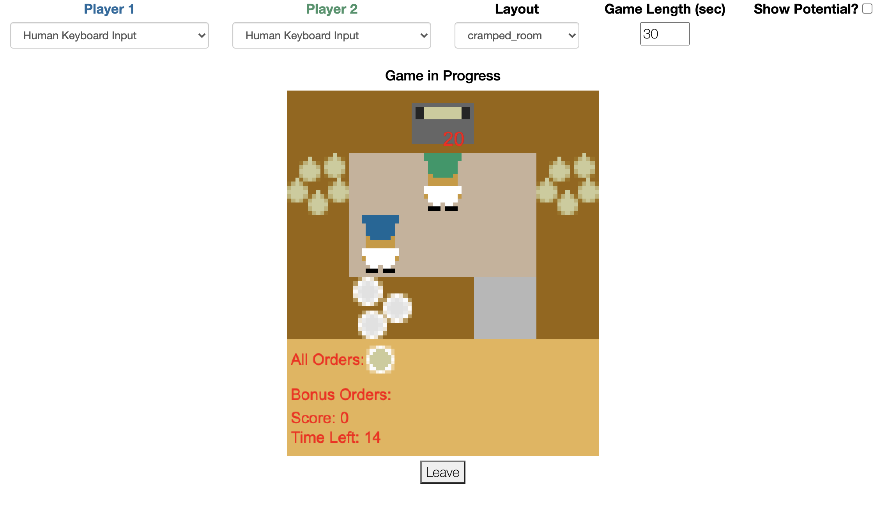

# Overcooked Demo
<p align="center">

</p>

A web application where humans can play Overcooked with trained AI agents.

* [Installation](#installation)
* [Usage](#usage)
* [Dependencies](#dependencies)
* [Using Pre-trained Agents](#using-pre-trained-agents)
* [Using BC PyTorch Agents](#using-bc-pytorch-agents)
* [Updating Overcooked_ai](#updating-overcooked_ai)
* [Configuration](#configuration)
* [Legacy Code](#legacy-code)

## Installation

Building the server image requires [Docker](https://docs.docker.com/get-docker/)

## Usage

The server can be deployed locally using the driver script included in the repo. To run the production server, use the command
```bash
./up.sh production
```

In order to build and run the development server, which includes a deterministic scheduler and helpful debugging logs, run
```bash
sed -i 's/"credsStore":/"#credsStore":/g' ~/.docker/config.json # if docker is troubling with creds
./up.sh
```
By default, `./up.sh` reuses the existing Docker image (no forced rebuild).  
By default it runs in foreground (you see live logs).  
Optional flags:
```bash
./up.sh --build           # build with cache, then run
./up.sh --rebuild         # no-cache rebuild, force recreate
./up.sh --detach          # run in background
./up.sh production --build
./up.sh production --rebuild
./up.sh production --detach
```

After running one of the above commands, navigate to http://localhost

In order to kill the production server, run
```bash
./down.sh
```

## Dependencies

The Overcooked-Demo server relies on both the [overcooked-ai](https://github.com/HumanCompatibleAI/overcooked_ai) and [human-aware-rl](https://github.com/HumanCompatibleAI/human_aware_rl) repos. The former contains the game logic, the latter contains the rl training code required for managing agents. Both repos are automatically cloned and installed in the Docker builds.

The branch of `overcooked_ai` and `human_aware_rl` imported in both the development and production servers can be specified by the `OVERCOOKED_BRANCH` and `HARL_BRANCH` environment variables, respectively. For example, to use the branch `foo` from `overcooked-ai` and branch `bar` from `human_aware_rl`, run
```bash
OVERCOOKED_BRANCH=foo HARL_BRANCH=bar ./up.sh
```
The default branch for both repos is currently `master`.

## Using Pre-trained Agents

Overcooked-Demo can dynamically load pre-trained agents provided by the user. In order to use a pre-trained agent, a pickle file should be added to the `agents` directory. The final structure will look like `static/assets/agents/<agent_name>/agent.pickle`. Note, to use the pre-defined rllib loading routine, the agent directory name must start with 'rllib', and contain the appropriate rllib checkpoint, config, and metadata files. For more detailed info and instructions see the [RllibDummy_CrampedRoom](server/static/assets/agents/RllibDummy_CrampedRoom/) example agent.

If a more complex or custom loading routing is necessary, one can subclass the `OvercookedGame` class and override the `get_policy` method, as done in [DummyOvercookedGame](server/game.py#L420). Make sure the subclass is properly imported [here](server/app.py#L5)

## Using BC PyTorch Agents

The server now supports loading BC policies trained in PyTorch (MLP or LSTM) via an agent manifest.

1. Train your BC model (from repo root):
```bash
python train_bc.py --model mlp --run-name my_mlp_bc
```
or
```bash
python train_bc.py --model lstm --run-name my_lstm_bc
```
Default training uses both player perspectives in one shared policy (`--player-mode both`).
2. Create an agent folder under `webapp/server/static/assets/agents/`, e.g. `BCTorchMLP`.
3. Copy checkpoint file (`best.pt`) into that folder.
4. Add `agent_manifest.json` in that folder. Example (MLP):
```json
{
  "type": "bc_torch",
  "model_type": "mlp",
  "checkpoint": "best.pt",
  "sampling_mode": "sample",
  "sampling_temperature": 1.0,
  "supported_layouts": ["cramped_room", "coordination_ring"],
  "input_dim": 96,
  "num_actions": 6,
  "mlp_hidden": [256, 128],
  "dropout": 0.1,
  "planner_cache_dir": ".cache/overcooked_planners"
}
```
Example (LSTM):
```json
{
  "type": "bc_torch",
  "model_type": "lstm",
  "checkpoint": "best.pt",
  "sampling_mode": "sample",
  "sampling_temperature": 1.0,
  "supported_layouts": ["cramped_room", "coordination_ring"],
  "input_dim": 96,
  "num_actions": 6,
  "seq_len": 20,
  "hidden_dim": 128,
  "num_layers": 1,
  "dropout": 0.1,
  "planner_cache_dir": ".cache/overcooked_planners"
}
```
5. Restart the server (`./up.sh` or `./up.sh production`). The folder name (e.g. `BCTorchMLP`) will appear in the UI dropdown automatically.

Notes:
- If a selected layout is not in `supported_layouts`, BC agent safely returns `STAY`.
- `player_idx` in manifest is optional. If omitted, runtime slot index is used.
- Default inference matches Overcooked-style sampling (`sampling_mode="sample"`), which helps prevent BC-vs-BC spawn deadlocks.
- For deterministic behavior set `sampling_mode` to `"argmax"` (optionally with `deadlock_break_after` > 0).
- BC agents use the same runtime interface as existing agents (`action(state)` and `reset()`), so they coexist with RLlib and pickle agents.

## Use the human vs. human game mode.

With the Overcooked demo, you can test the interaction between two human players. To do this, you need to deploy this code on the server (https://docs.docker.com/language/python/deploy/). 
After successful deployment, the first user should open http://[server_ip_address]/, select the human keyboard input for both players and click on "Create game". If everything has been successful, he will receive a message: "Waiting for game to start".
Another user should open a page at http://[server_ip_address]/psiturk to start the game.  

If you want to run a test on a local computer, you should use "localhost" instead of "server_ip_address" and open the corresponding links in different tabs.

## Updating Overcooked_ai
This repo was designed to be as flexible to changes in overcooked_ai as possible. To change the branch used, use the `OVERCOOKED_BRANCH` environment variable shown above.

Changes to the JSON state representation of the game will require updating the JS graphics. At the highest level, a graphics implementation must implement the functions `graphics_start`, called at the start of each game, `graphics_end`, called at the end of each game, and `drawState`, called at every timestep tick. See [dummy_graphcis.js](server/graphics/dummy_graphics.js) for a barebones example.

The graphics file is dynamically loaded into the docker container and served to the client. Which file is loaded is determined by the `GRAPHICS` environment variable. For example, to server `dummy_graphics.js` one would run
```bash
GRAPHICS=dummy_graphics.js ./up.sh
```
The default graphics file is currently `overcooked_graphics_v2.1.js`


## Configuration

Basic game settings can be configured by changing the values in [config.json](server/config.json)

## Legacy Code

For legacy code compatible with the Neurips2019 submission please see [this](https://github.com/HumanCompatibleAI/overcooked-demo/tree/legacy) branch of this repo. 
